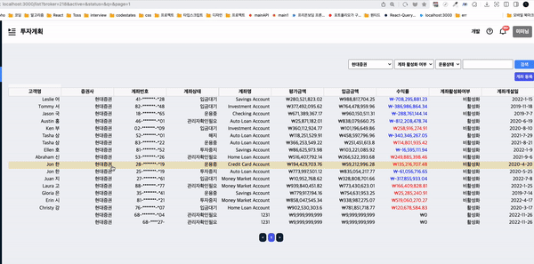
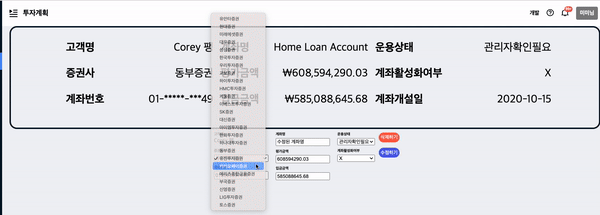
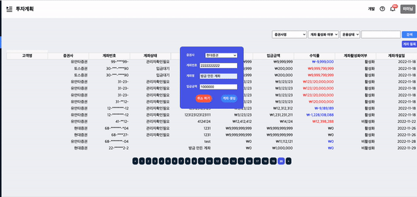

## **✨ 배포 링크**

### [배포 바로가기](https://pre-onboarding-7th-3-2-9-neon.vercel.app/)

### 로그인 ID / PASSWORD

### `1234@1234.com` // `1234`


## **📰 프로젝트 설명**
[회고](https://velog.io/@anotherhoon/Week-3-1-%ED%9A%8C%EA%B3%A0)

- 투자 관리 서비스의 관리자 기능 구현


## **🛠 Dev Tools**

 
   

## **📝 디렉토리 구조**

```
   📂pages
    ┗ 📂list
      ┗📄[id].tsx
    ┗ 📂user
    ┣📄_app.tsx
    ┗📄index.tsx
   📂src
   ┗ 📂api
   ┗ 📂components
   ┗ 📂container
   ┗ 📂styles
   ┗ 📂types
   ┗ 📂utils
```

## ✨ 기능 구현

 - 표기 정보를 react-form-hook을 이용하여 구현하였습니다. 

 - 고객명: usersData에서 id를 계좌정보의 user_id와 매칭하여 실제 이름 표시
 
 >Next.js의 getServerSideProps와 react-query의 prefetchQuery를 이용하여 유저와 계좌 정보를 서버에서 클라이언트로 보내주고 usersData에 있는 id와 accountData의 user_id가 같은 usersData의 name프로퍼티 값을 찾습니다.

 - 데이터 필터링 기능 구현 : 페이지의 query값을 기반으로 하여 필터링을 관리하였습니다.
<p align="center">
  <br>
  
  <br>
</p>

- useMutation : useMutation을 이용하여, 계좌 수정, 생성시 서버로부터 새로운 데이터를 즉시 받아와 적용합니다.

<p align="center">
  <br>
  
  <br>
</p>

<p align="center">
  <br>
  
  <br>
</p>


## **🌱 commit message 규칙**

<details>
<summary>커밋 규칙</summary>
<div markdown="1">

⭐ feat : 새로운 기능에 대한 커밋

🎨 ui : 새로운 CSS관련 디자인에 대한 커밋

🛠 fix : 버그 수정에 대한 커밋

🧱 build : 빌드 관련 파일 수정에 대한 커밋

👏 chore : 파일 이동, 파일명 수정, 변수 제거 등의 자잘한 수정에 대한 커밋

⚒ refactor : 코드 리팩토링에 대한 커밋

📝 style : 공백 제거와 같은, 코드 스타일 혹은 포맷 등에 관한 커밋

✏ docs : 문서 수정에 대한 커밋

💡 ci : CI관련 설정 수정에 대한 커밋


</div>
</details>

## 📚 사용 Library

<details>
<summary>Lib List</summary>
<div markdown="1">

### 공통 Lib
- eslint
- eslint-config-prettier
- husky
- prettier

### production
- typescript
- react-query
- styled-components
- axios
-  react-hook-form
-  react-cookies
- react-loader-spinner

</div>
</details>